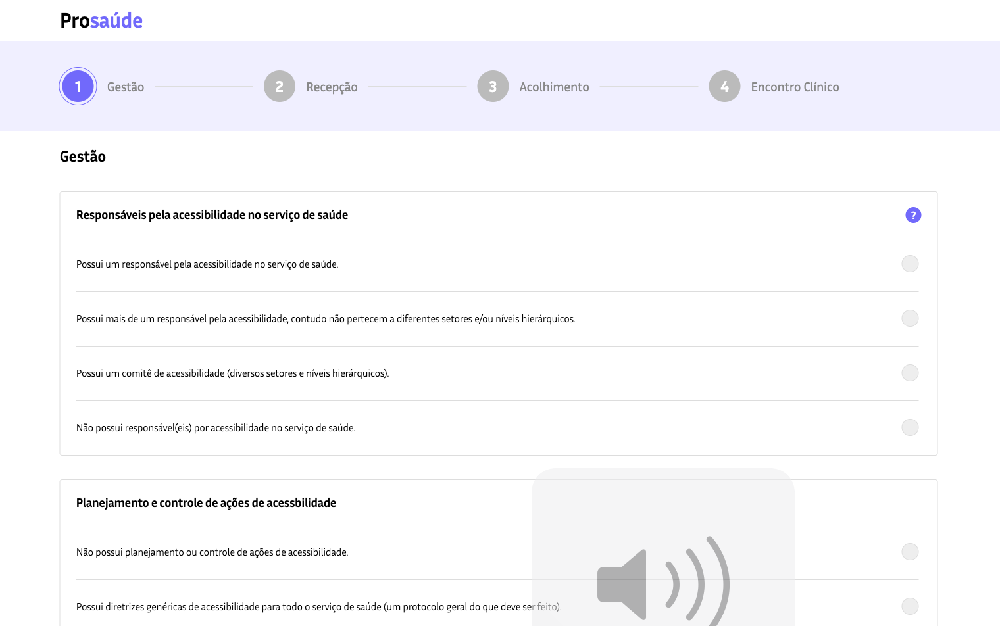
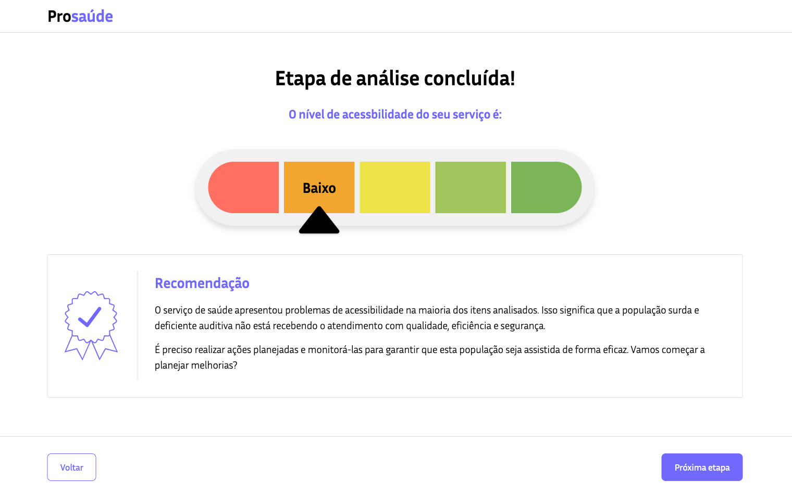

# ProSaúde
Repository for a ProSaúde software. A tool for analysis, planning and monitoring of accessibility to health, outpatient and emergency services for deaf and hard of hearing people.

# Made with
- HTML
- CSS
- JavaScript.

